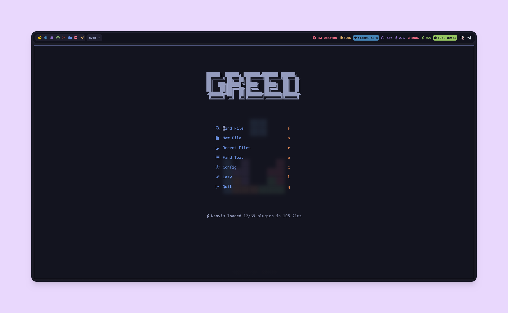
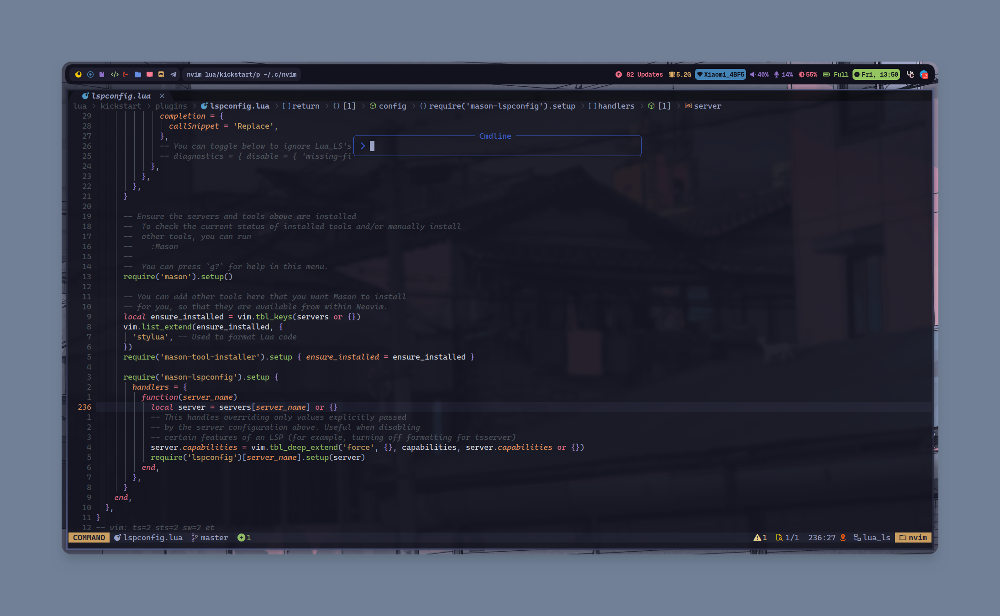

# My nvim config (built upon `kickstart.nvim`)

Built my config on `kickstart.nvim`, added new plugins, keymaps and options to better fit my workflow and usecase

## Plugins added : 

[Barbecue](https://github.com/utilyre/barbecue.nvim) [ VSCode like winbar of neovim ]

[CodeSnap](https://github.com/mistricky/codesnap.nvim) [ To snap highlighted code ]

[Startup](https://github.com/startup-nvim/startup.nvim) [ For dashboard when opening neovim ] 

[Flash](https://github.com/folke/flash.nvim) [ To jump to a word in open buffer ] 

[Harpoon](https://github.com/Theprimeagen/harpoon) [ To jump between files in open workspaces ] 

[Lualine](https://github.com/nvim-lualine/lualine.nvim) [ For pretty lualine (Depends on [Lualine so Fancy](https://github.com/greeid/lualine-so-fancy)) ] 

[Noice](https://github.com/folke/noice.nvim) [ For floating commandline ] 

[NvTerm](https://github.com/NvChad/nvterm) [ For terminals ] 

[Oil](https://github.com/stevearc/oil.nvim) [ To edit file tree like buffer ] 

[Bufferline](https://github.com/akinsho/bufferline.nvim) [ To view open buffers ] 

[Tabscope](https://github.com/backdround/tabscobe.nvim) [ For per tab buffer system ]

## Screenshots

### Dashboard : 

 

### Other stuffs : 

 

### Per tab buffers :  

 

> [!NOTE]
> More plugins are added but not mentioned in README

> [!IMPORTANT]
> Please take this only as reference, I always suggest building your own config for more control over it
